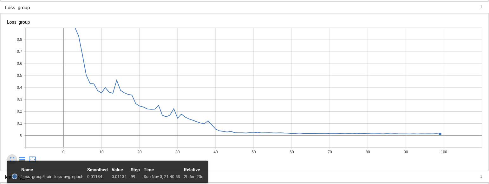
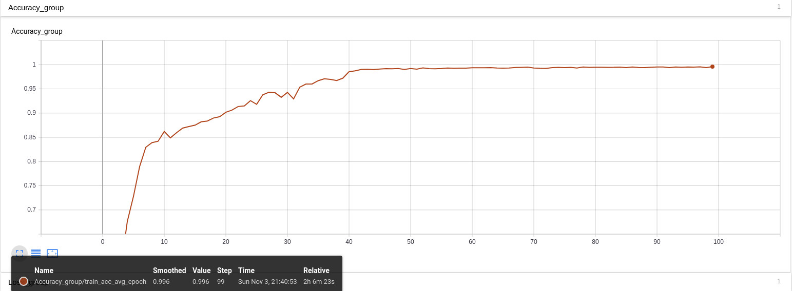
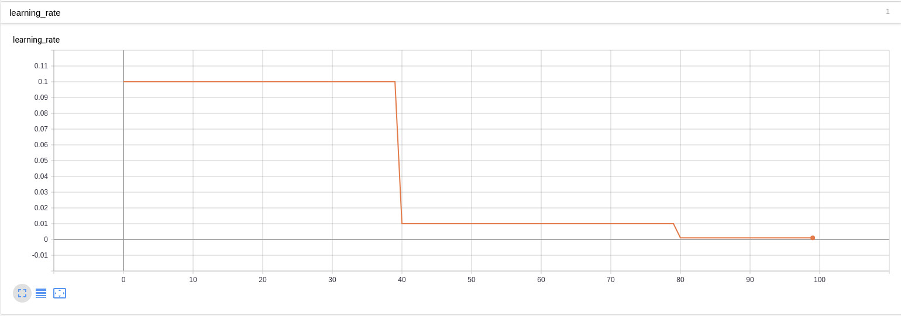

Weather Classification Experimental Notes

====

用神经网络对天气进行分类的实验记录
-------

# introduction

采用两个不同的数据库：
1. Two-class Weather Classification

   --日常场景的不同天气图片，包括sunny，cloudy  一共1万张。
2. UA-DETRAC 
 
   --中国公路场景的不同天气图片，原用于多目标检测和跟踪任务，包括sunny，cloudy， night， rainy  一共14.0131万张。

采用的神经网络：
直接用resnet101,最后的全连接层输出改为2或4。

## Benchmarking

1). Two-class Weather Classification (Trainval/Test: 8000/2000, model: resnet101) by run main-cuda.py

index |model   |scale |batch |pre-trained|lr  |lr step |max epoch |time/epoch |train/mem/GPU |Acc/train |Acc/test |test fps  |test/mem/GPU |
------|--------|------|------|-----------|----|----- --|----------|-----------|--------------|----------|---------|----------|-------------|
1-1   |Res-101 |64    |512   |NO         |0.1 |40      |100       |65 s       |6729 MB       |1.00      |0.85     |126.59    | 6249        |

2). UA-DETRAC (Trainval/Test: 112104/28027, model: resnet101) by run main-cuda.py

index |model   |scale |batch |pre-trained|lr  |lr step |max epoch |time/epoch |train/mem/GPU |Acc/train |Acc/test |test fps  |test/mem/GPU |
------|--------|------|------|-----------|----|----- --|----------|-----------|--------------|----------|---------|----------|-------------|
2-1   |Res-101 |64    |512   |NO         |0.1 |40      |100       |900 s      |6729 MB       |1.00      |0.85     |          |             |

* Our pre-trained model weight can simply import via torchvision.
* If not mentioned, the GPU we used is NVIDIA Titan X Pascal (12GB).

## Datagram

1). Two-class Weather Classification (Trainval/Test: 8000/2000, model: resnet101) by run main-cuda.py

    index == 1-1     dir == 11-03_19-33-17
    Loss
    

    
    

    accuracy
    

    
    

    learning_rate
    

    
    

## Preparation

TODO

### prerequisites

* Python 3.7
* Pytorch 1.0
* CUDA 9.0

### Data Preparation

TODO

### Compilation

TODO

## Train

TODO

## Demo

TODO

## Video Demo

TODO

## Authorship

TODO

## Citation

TODO
